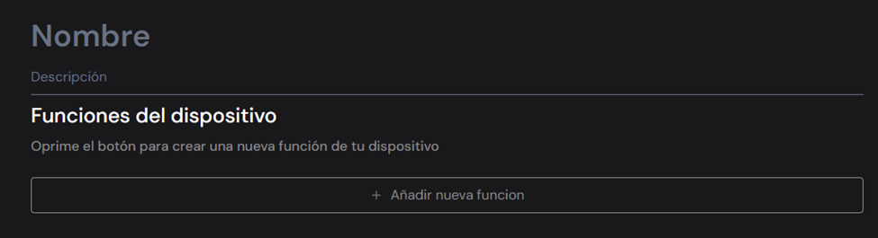

# Añadir dispositivos
En el menú principal de la página, en la sección dispositivos (mostrada anteriormente), al seleccionar la opción “Añadir dispositivo” aparecerá la siguiente sección:

En nombre se debe poner el nombre del dispositivo y en descripción una explicación de lo que realiza.
Luego, se debe dar click al botón añadir nueva función para acceder a la configuración de este, lo que nos lleva a la siguiente seccion. 