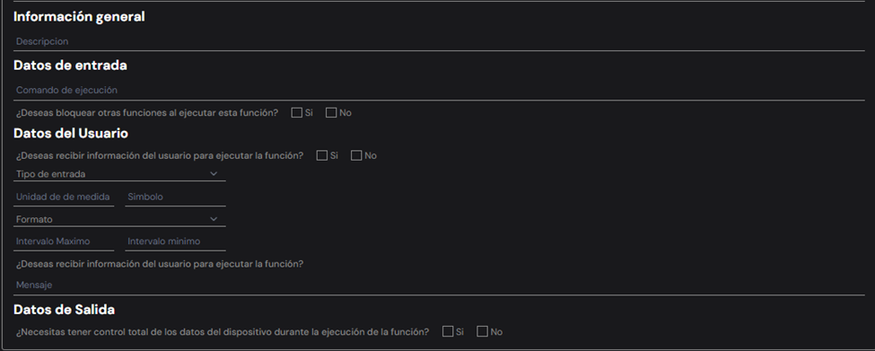

# Creando funciones 
Al momento de crear funciones debemos llenar los siguientes espacios:


Los campos se completan como se indica a continuación:

**Informacion general**
```bash 
Nombre de la función: La palabra con la que quiera identificar la función creada
```
**Datos de entrada**
```bash
Comando de ejecución: La palabra o letra con la que la pagina va a ejecutar la 
función creada
Al seleccionar la opcion de bloquear otras funciones cuando se ejecute la que 
esta creando, solo se podra ejecutar esta función, lo que impide hacer tareas de 
forma simultanea
```
**Datos del usuario**
```bash
-Al confirmar recibir información del usuario, esto hará que antes de ejecutar la
 funcion le pida al usuario algun tipo de dato.
-El tipo de entrada se refiere al tipo de dato que se le pedira al usuario, solo
 hay 2 tipos, texto o numeros

```
